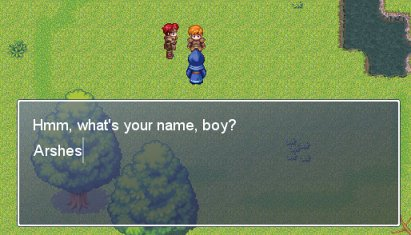

Input Text Event Command (v 2.0)
===

Allows the player to input text in message windows, just like the default "Input Number" event command for numbers except using the keyboard instead of only cursor arrows.

Features
---
* Easy to use - just like the Input Number event command (except better, since it handles much more than just numbers)
* Stores input as regular variables (printable in messages by \V[x])
* Recognizes all characters on standard US keyboard (punctuation etc.)
* Player input is stored when saving your game (like the database's variables)
* Designed to adapt to most fonts

Demo
---
See `demo` directory. Requires RMXP, of course.

Installation
---
Copy the script in `src`, and open the Script Editor within RMXP. At the bottom of the list of classes on the left side of the new window, you'll see one called "Main". Right click on it and select "Insert". In the newly created entry in the list, paste this script.

This script has two dependencies that must both be above this script (in this order):

1. The [SDK](http://www.hbgames.org/forums/viewtopic.php?t=1802.0), which must be above this script. (When it was developed, SDK 1.5 was the latest version.)
1. Near Fantastica's Keyboard Input Module version 5 (available in the `lib` dir).

Usage
---
Allows the player to input text with the keyboard in much the same way as the "Input Number" command. Simply enter the following into a call script event command:

    input_text(id, chars_max, 'default')

where...

`id`: ID of the variable in which to store the input text, e.g. 1. Note: leading 0's will cause problems, e.g. 008

`chars_max`: (optional) max number of characters to be allowed, e.g. 10. Note: leave blank or set as 0 for no limit.

`default`: (optional) default text to appear, e.g. 'Bob'

As with the "Input Number" command, if it is directly preceded by a "Show Text" command and there is available space in the message window, the "Text Input" prompt will appear in the same window as the message text. Otherwise, it will appear in its own window.

The input text can then be used as any variable, e.g. in messages (`\V[x]`), conditional branches, call scripts, etc.

A sample use is for passwords, riddles, and names.

Some keycodes assume the US standard keyboard. See the MSDN library's [virtual keycodes reference](http://msdn.microsoft.com/library/default.asp?url=/library/en-us/winui/winui/WindowsUserInterface/UserInput/VirtualKeyCodes.asp) for complete details.

Version history
---
0.99 - original release

1.0 - switched over to using regular variables

2.0

* vastly improved quality of keyboard input
   * variable-width letters
   * all characters on standard US keyboard supported (punctuation etc.)
   * added support for Delete (not just backspace), Home and End keys
   * added Capslock support
   * added cursor and Ctrl-cursor support
   * added numpad support
   * max number of displayable characters dynamically found and enforced (user can set lower maximum if desired)
* added configurable sound
* fixed bug with long input strings
* SDK compatible

